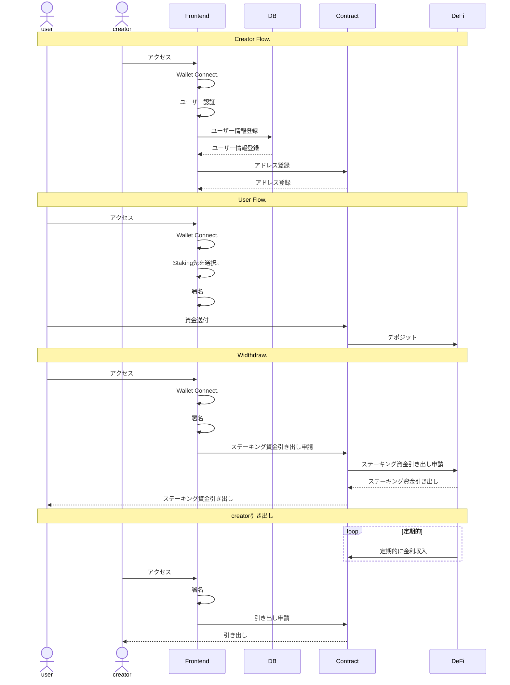

# シーケンス図

```mermaid
sequenceDiagram
    actor user
    actor creator
    participant frontend as Frontend
    participant db as DB
    participant contract as Contract
    participant defi as DeFi

    Note over user,defi: Creator Flow.
    creator ->> frontend: アクセス
    frontend ->> frontend: Wallet Connect.
    frontend ->> frontend: ユーザー認証
    frontend ->> db: ユーザー情報登録
    db -->> frontend: ユーザー情報登録
    frontend ->> contract: アドレス登録
    contract -->> frontend: アドレス登録

    Note over user,defi: User Flow.
    user ->> frontend: アクセス
    frontend ->> frontend: Wallet Connect.
    frontend ->> frontend: Staking先を選択。
    frontend ->> frontend: 署名
    user ->> contract: 資金送付
    contract ->> defi: デポジット

    Note over user,defi: Widthdraw.
    user ->> frontend: アクセス
    frontend ->> frontend: Wallet Connect.
    frontend ->> frontend: 署名
    frontend ->> contract: ステーキング資金引き出し申請
    contract ->> defi: ステーキング資金引き出し申請
    defi -->> contract: ステーキング資金引き出し
    contract -->> user: ステーキング資金引き出し

    Note over user,defi: creator引き出し
    loop 定期的
        defi ->> contract: 定期的に金利収入
    end
    creator ->> frontend: アクセス
    frontend ->> frontend: 署名
    frontend ->> contract: 引き出し申請
    contract -->> creator: 引き出し
```
